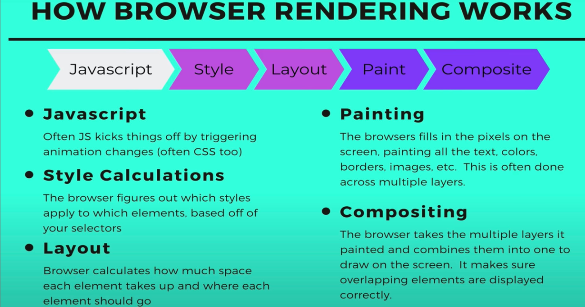
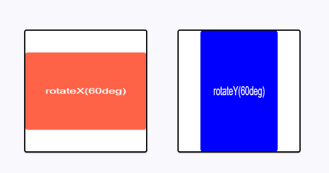
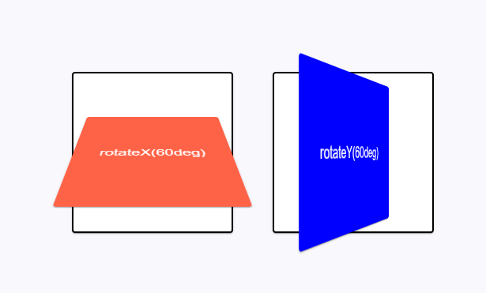
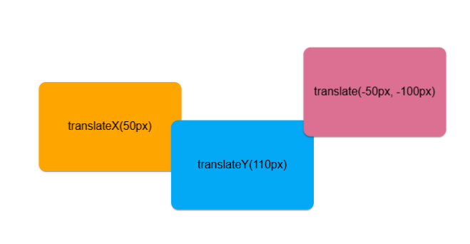
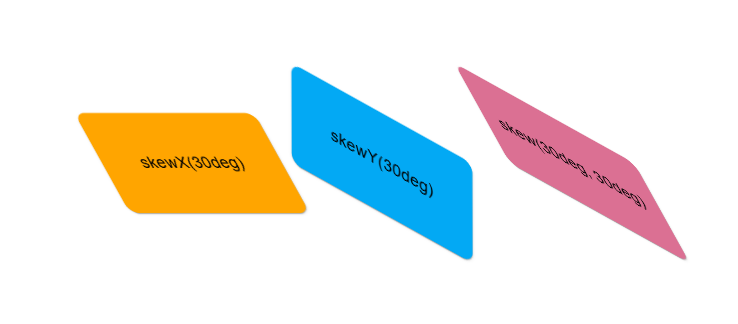
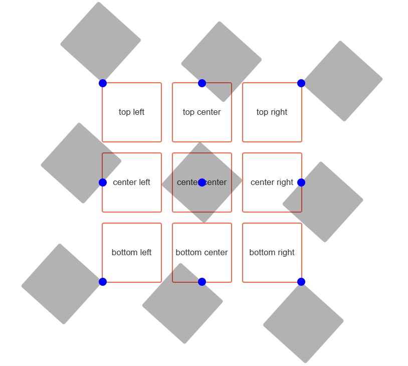

# Лекция 10: Анимации (CSS переходы, CSS анимации, 2D-трансформации)

## 1. CSS Переходы (Transitions)

**Анимация** — это процесс плавного изменения визуальных свойств элементов. Она оживляет интерфейс, делая взаимодействие с сайтом интуитивным.

### ✨ Зачем нужна анимация?

* **Привлекает внимание:** выделяет кнопки или уведомления.
* **Улучшает UX:** делает смену состояний естественной для глаза.
* **Добавляет стиль:** подчеркивает индивидуальность проекта.
* **Информативность:** объясняет процесс загрузки или перемещения данных.

### Основные свойства управления переходом:

1. `transition-property`: какое именно свойство анимируем (`background-color`, `transform`, `all`).
2. `transition-duration`: время анимации (`500ms`, `2s`).
3. `transition-timing-function`: как распределяется скорость (функция времени).
4. `transition-delay`: задержка перед началом.

#### Пример:

```css
.box {
    width: 200px;
    height: 200px;
    background-color: tomato;
    
    /* Сокращенная запись: свойство | время | функция | задержка */
    transition: background-color 500ms linear 0s, 
                transform 500ms ease-in-out 0s;
}

.box:hover {
    background-color: blue;
    transform: rotate(360deg) scale(1.2);
}

```

---

## 1.1 Функции распределения времени (`timing-function`)

Описывают поведение скорости анимации:

* `linear` — равномерно от начала до конца.
* `ease` — медленный старт, ускорение и замедление в конце (по умолчанию).
* `ease-in` — медленно в начале, затем ускорение.
* `ease-out` — быстро в начале, затем замедление.
* `ease-in-out` — медленно в начале и в конце.
* `cubic-bezier(x1, y1, x2, y2)` — ручная настройка кривой ускорения.
* *Инструмент:* [cubic-bezier.com](https://cubic-bezier.com/)


---

## 2. Производительность: что анимировать?

Браузер отрисовывает страницу в несколько этапов:

1. **Style** → 2. **Layout** (геометрия) → 3. **Paint** (отрисовка пикселей) → 4. **Composite** (сборка слоев).

Чтобы анимация была плавной (60 FPS) и не тормозила компьютер пользователя, рекомендуется анимировать только два свойства:

1. **`opacity`** (прозрачность).
2. **`transform`** (перемещение `translate`, масштаб `scale`, поворот `rotate`).

> **Важно:** Анимация свойств типа `width`, `height` или `margin` заставляет браузер пересчитывать геометрию всего сайта (**Layout**), что очень «дорого» для производительности. **Всегда заменяйте `margin-left` на `transform: translateX()`.**

---

## 2.1 Эффект выезжающего контента (`overflow: hidden`)

Используется для создания декоративных панелей (overlay), которые «прячутся» за границами родителя.

```css
.box {
    position: relative;
    width: 300px;
    height: 300px;
    overflow: hidden; /* Скрывает всё, что выходит за границы */
}

.overlay {
    position: absolute;
    top: 0; left: 0;
    width: 100%; height: 100%;
    background-color: aqua;
    
    /* Прячем блок, сдвинув его на 100% влево */
    transform: translateX(-100%); 
    transition: transform 250ms ease;
}

.box:hover .overlay {
    /* Возвращаем блок на место */
    transform: translateX(0);
}

```

---

## 3. CSS Анимация (`@keyframes`)

В отличие от переходов (`transition`), анимация:

* Не требует обязательного события (типа `:hover`).
* Может иметь бесконечное количество промежуточных точек.
* Может зацикливаться (`infinite`).

### Создание анимации:
Анимация объявляется директивой `@keyframes`, которая позволяет описать набор кадров (frames, состояний) анимации, которых должно быть как минимум два (начальный и конечный).
Кадры определяют в какой момент времени изменяются анимируемые свойства и описываются ключевыми словами `from` (псевдоним 0%) и `to` (псевдоним 100%) или, чаще всего, в виде процентов в промежутке 0%-100%, так как проценты позволяют указать произвольное значение.
Объявим анимацию для изменения цвета фона элемента и смещение его по горизонтальной оси в право в трёх точках: 0%, 50% и 100%.

```css
@keyframes moveAndColor {
  0% {
    transform: translateX(0);
    background-color: #ff8a80;
  }
  50% {
    transform: translateX(100px);
    background-color: #80d8ff;
  }
  100% {
    transform: translateX(0);
    background-color: #a7ffeb;
  }
}
```
Чтобы использовать уже объявленную анимацию, нужно указать её имя в качестве значения для свойства `animation-name`.
Анимацию можно добавить к селектору, тогда она будет применена сразу, при загрузке страницы.
```css
.box3 {
    width: 200px;
    height: 100px;
    background-color: #ff8a80;
    /* Применяем анимацию */
    animation-name: moveAndColor;
}

```
Также можно применить анимацию по событию, например ховеру или фокусу, используя соответствующие псевдоклассы.
```css
/* Добавляем анимацию по ховеру */
.box:hover {
  animation-name: moveAndColor;
}
```
### Свойства `animation`:
* **`animation-duration`**: Устанавливает продолжительность анимации — время, за которое будут пройдены все кадры. Задаётся в секундах `s` или миллисекундах `ms`. Если не задать длительность, анимация будет мгновенной.
* **`animation-timing-function`**: Устанавливает функцию [распределения времени](https://cubic-bezier.com/#.17,.67,.83,.67) для анимации, значения аналогичны `transition-timing-function` в **CSS-переходах**.
* **`animation-delay`**: Устанавливает задержку перед началом анимации в секундах `s` или миллисекундах `ms`.
* **`animation-iteration-count`**: Указывает, сколько раз повторить анимацию. Принимает числовое значение или ключевое слово `infinite` (бесконечно).
* **`animation-direction`**: Определяет направление воспроизведения:
    * `normal` — анимация идет от начала до конца, затем сбрасывается. Это значение по умолчанию.
    * `reverse` — анимация идет в обратном направлении (от конца к началу).
    * `alternate` — анимация идет вперед, затем назад, чередуя направление при каждом повторе.
    * `alternate-reverse` — анимация начинается с обратного направления, затем чередуется.


* **`animation-fill-mode`**: Определяет, какие стили применяются к элементу до и после анимации:
    * `none` — стили влияют на элемент только во время анимации. Значение по умолчанию.
    * `forwards` — элемент сохраняет стили последнего кадра после завершения.
    * `backwards` — элемент принимает стили первого кадра сразу (еще во время задержки `delay`).
    * `both` — применяет оба правила (`forwards` и `backwards`).


* **`animation-play-state`**: Позволяет приостановить анимацию.
    * `running` — анимация проигрывается (по умолчанию).
    * `paused` — анимация замирает (удобно использовать при `:hover`).

Составное свойство позволяет более кратко записать свойства анимации.

```css
animation: [name] [duration] [timing-function] [delay] [iteration-count] [direction] [fill-mode] [play-state]
```

Значения необязательных свойств можно пропустить или поменять местами. Исключение составляют свойства `duration` и `delay` - значение длительности анимации всегда должно указываться до задержки.

```css
.box {
  animation: magic 2s infinite;
}

.box {
  animation: magic 2s 0.5s ease-in-out;
}

.box {
  animation: magic 2s ease-in-out 0.5s forwards;
}

.box {
  animation: magic 2s forwards infinite ease-out 0.5s;
}

@keyframes magic {
  /* ... */
}
```
---
### Перспектива
По умолчанию элемент рендерится в **2D-пространстве** и при трансформациях по осям *X* и *Y*, например `rotate`, искажается и выглядит неестественно.

```html
<div class="box"></div>
<div class="box2"></div>
```
```css
.box {
  width: 100px;
  height: 100px;
  background: tomato;

  animation: rotateX 1500ms infinite alternate ease-in-out 1000ms;
}

.box2 {
  width: 100px;
  height: 100px;
  background: rgb(3, 44, 248);

  animation: rotateY 1500ms infinite alternate ease-in-out 1000ms;
}

@keyframes rotateX {
  from {
    transform: rotateX(0deg);
  }
  to {
    transform: rotateX(60deg);
  }
}

@keyframes rotateY {
  0% {
    transform: rotateY(0deg);
  }

  100% {
    transform: rotateY(60deg);
  }
}
```


**Функция `perspective()`**
Это еще одна функция трансформации для свойства `transform`, которая позволяет задать перспективу одному элементу, к которому применяется, то ксть создать 3d эффект
```html
  <div class="box1">X</div>
  <div class="box2">Y</div>
```

```css
.box1 {
  color: white;
  width: 100px;
  height: 100px;
  background: tomato;
  animation: rotateX 2s infinite alternate ease-in-out;
}

.box2 {
  color:white;
  width: 100px;
  height: 100px;
  background: blue;
  animation: rotateY 2s infinite alternate ease-in-out;
}

@keyframes rotateX {
  from {
    transform: perspective(100px) rotateX(0deg);
  }
  to {
    transform: perspective(100px) rotateX(60deg);
  }
}

@keyframes rotateY {
  from {
    transform: perspective(100px) rotateY(0deg);
  }
  to {
    transform: perspective(100px) rotateY(60deg);
  }
}
```


Если говорить просто: `perspective` — это расстояние от твоих глаз до экрана монитора (виртуальное, конечно).
* Чем МЕНЬШЕ значение (например, 100px): Ты как будто подносишь кубик прямо к самому носу. Искажения будут огромными, агрессивными и очень «выпуклыми».
* Чем БОЛЬШЕ значение (например, 2000px): Ты смотришь на объект издалека (через бинокль). 3D-эффект будет почти незаметен, вращение будет казаться плоским.

**Значение 400px — 600px:** Считается «золотой серединой» для небольших элементов. Оно создает реалистичный объем, который приятен глазу и не ломает картинку.

Как это работает?
Когда ты пишешь `perspective(100px)` внутри свойства `transform`, браузер понимает:
* Нужно включить 3D-режим.
* Точка обзора находится в 400 пикселях от плоскости экрана.
Когда квадрат крутится по оси X или Y, его ближние края становятся чуть больше, а дальние — чуть меньше. Именно эта разница в размерах и создает иллюзию объема.
---

## 4. 2D-трансформации
CSS-трансформации позволяют сдвигать, изменять масштаб и поворачивать элементы, то есть добавлять декоративные эффекты. Трансформации изменяют форму и положение элемента не влияя на остальные элементы страницы. По умолчанию трансформация происходит относительно центра элемента, но это можно изменить.

### Свойство transform
Отвечает за применение одной или более трансформаций к элементу.

```css
transform: none | <тип трансформации> <тип трансформации> ...
```

Трансформированный элемент - это элемент с любым установленным значением свойства `transform`, отличным от `none`.

**Масштабирование**
Функции `scaleX(tx)`, `scaleY(ty)` и `scale(tx, ty)` масштабируют блок по ширине и/или высоте, не влияя на геометрию окружающих элементов. Если для `scale()` указано одно значение, второе будет такое же самое.

```css
.box {
  transform: scale(1.15);
}
```

Начальный масштаб элемента - 1. Значения от 1 до 0 уменьшают элемент, больше 1 - наоборот, увеличивают. Например, значение `scale(1.25)` это *125%* от начального размера, а `scale(0.75)` - *75%*.

**Поворот**
Функция `rotate(угол)` поворачивает элементы на заданное количество градусов (единица `deg`). Положительные значения поворачивают элемент по часовой стрелке, отрицательные - против.

```css
.box {
  transform: rotate(45deg);
}
```
**Смещение**
Функции `translateX(tx)`, `translateY(ty)` и `translate(tx, ty)` перемещают элемент в горизонтальном (ось X) и/или вертикальном (ось Y) направлениях относительно начального положения.
* Положительные значения X смещают элемент вправо, отрицательные - влево.
* Положительные значения Y смещают элемент вниз, отрицательные - вверх.
* Значения могут быть в пикселях или процентах. Если значение задано в процентах, то оно рассчитывается от размера смещаемого элемента.

```css
.box {
  transform: translate(100px, 200px);
}
```


**Центрирование элемента**
Рассмотрим приём, при помощи которого можно поставить абсолютно позиционированный элемент точно по центру блока, относительно которого он позиционируется. Техника очень простая и состоит из трёх шагов.

```css
.box {
  position: absolute;
  top: 50%;
  left: 50%;
  transform: translate(-50%, -50%);
}
```
* Абсолютно позициоинируем элемент относительно предка.
* Задаём элементу свойства `top` и `left` со значением `50%`, это поставит верхний левый угол элемента ровно по центру предка.
* Задаём элементу отрицательное смещение `translate` по `50%` его высоты и ширины. Это подвинет элемент вверх и влево и отцентрирует внутри предка.

**Искажение**
Функции `skewX(угол)`, `skewY(угол)` и `skew(x-угол, y-угол)` используются для искажения (наклона, деформирования) сторон элемента относительно координатных осей. Если для `skew()` указано только одно значение, второе будет равно `0`, то есть это будет аналог `skewX()`.

```css
.box {
  transform: skew(30deg);
}
```


**Точка трансформации**
Свойство `transform-origin` позволяет сместить точку трансформации, относительно которой происходит изменение положения, размера или формы элемента. Значение по умолчанию — `center`, или `50% 50%`. Задаётся только для трансформированных элементов. Не наследуется.

```css
.box:nth-child(1)::before {
  transform-origin: top left;
}
```

В примере точка трансформации каждого элемента обозначена синей меткой. Значения можно указывать не только ключевыми словами, но также в пикселях или процентах.


---
### 📚 Полезный ресурс для закрепления:

* [MDN: CSS Transitions & Animations](https://developer.mozilla.org/ru/docs/Web/CSS/Guides/Animations/Using) — База знаний для фундаментального разбора в теории;
* [Animista](https://animista.net/) — Лучшая песочница, можна выбрать категорию (вход, выход, внимание, текст), настраиваешь параметры и сразу видишь результат.
---

### 🗺 Навигация:

[⬅ Лекция 9: Векторная графика, SVG-документы, SVG-спрайты,](./lekce9.md) | [🏠 В оглавление](./README.md) | [Лекция 11: CSS-методологии ➡](./lekce11.md)
