# Лекция 4: Свойство Display, Flexbox и Псевдоклассы

## 1. 📦 Введение: От коробки к макету

На прошлом занятии мы узнали, что каждый элемент — это **Box** (содержимое, отступы, рамки). Мы научились создавать эти «коробки», но теперь перед нами встают новые вопросы:

* Как выстроить боксы в ряд?
* Как идеально центрировать элемент?
* Как распределить пространство между ними?
* Как сделать структуру адаптивной?

---

## 2. 📐 Свойство `display`

Именно `display` определяет «характер» элемента и то, как он взаимодействует с соседями.

### 2.1 Блочные элементы (`display: block`)

Используются для крупных разделов (`<header>`, `<footer>`, `<section>`) и текста (`<h1>`, `<p>`, `<ul>`).

* **Особенности:** Занимают всю ширину, начинаются с новой строки. Можно задавать `width` и `height`.

### 2.2 Строчные элементы (`display: inline`)

Используются для оформления текста (`<span>`, `<a>`, `<strong>`).

* **Особенности:** Располагаются в одну строку. Свойства `width`, `height` и вертикальные `margin` **не работают**.

### 2.3 Строчно-блочные (`display: inline-block`)

Гибрид: элементы стоят в одну строку, но им можно задавать размеры и отступы.

> **Проблема:** Старые методы верстки (float, таблицы) создавали лишние пробелы и сложности с выравниванием. Для решения этих проблем был создан **Flexbox**.

---

## 3. 🧩 Flexbox (Стандарт современной верстки)

**Flexbox** — это модуль для управления расположением элементов. С 2015 года он является мировым стандартом.

**Главный принцип:**

1. Есть **Flex-контейнер** (родитель).
2. Внутри него — **Flex-элементы** (дети).

```css
.container {
    display: flex; /* Магия начинается здесь */
}

```

### 3.1 Основные оси

Когда вы включаете `flex`, создаются две оси:

1. **Главная ось (Main Axis)** — по ней выстраиваются элементы.
2. **Поперечная ось (Cross Axis)** — перпендикулярная ей.

Направление зависит от `flex-direction`:

* `row` (по умолчанию): Главная ось — горизонтальная (слева направо).
* `column`: Главная ось — вертикальная (сверху вниз).

### 3.2 Управление контейнером

| Свойство | Что делает | Варианты |
| --- | --- | --- |
| **justify-content** | Выравнивание по **главной** оси | `center`, `space-between`, `space-around`, `flex-end` |
| **align-items** | Выравнивание по **поперечной** оси | `center`, `flex-start`, `stretch` |
| **flex-wrap** | Перенос элементов на новую строку | `nowrap` (в одну линию), `wrap` (с переносом) |
| **gap** | Промежутки между блоками | `gap: 20px;` |

### 3.3 Управление элементами (дети)

Используется свойство-сокращение `flex: grow shrink basis;`

* **flex-grow**: Способность элемента расти (0 — нет, 1 — да).
* **flex-shrink**: Способность сжиматься при нехватке места.
* **flex-basis**: Начальный размер элемента перед распределением места.

---

## 4. 🧠 Практические приемы

### Формула идеального центрирования

Если нужно центрировать блок внутри другого блока (и по вертикали, и по горизонтали):

```css
.parent {
    display: flex;
    justify-content: center;
    align-items: center;
    height: 100vh; /* На всю высоту экрана */
}

```

### Layout Container (Ограничитель)

Чтобы контент сайта не «расползался» на широких мониторах:

```css
.container {
    max-width: 1200px; /* Ограничили ширину */
    margin: 0 auto;    /* Центрировали сам контейнер */
    padding: 0 15px;   /* Отступы, чтобы текст не лип к краям */
}

```

---

## 5. 📑 Структурные псевдоклассы

Позволяют выбирать элементы по их позиции в списке без добавления лишних классов.

* `:first-child` — первый ребенок. Выбирает самый первый элемент среди соседей. Идеально для обнуления `margin-top`.
  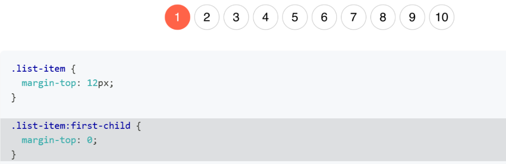
* `:last-child` — последний ребенок.
   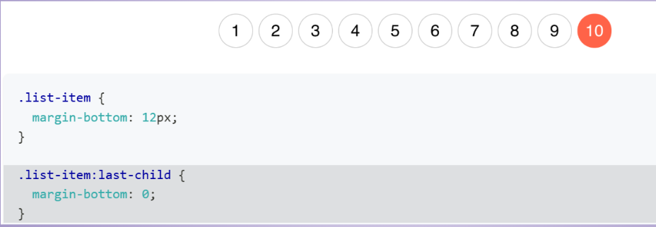
* `:not(:last-child)` — кроме последнего.
* `:nth-child(even/odd)` — четные / нечетные элементы.
   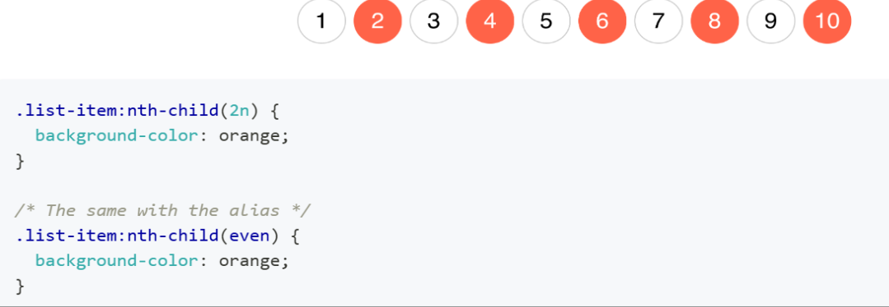
   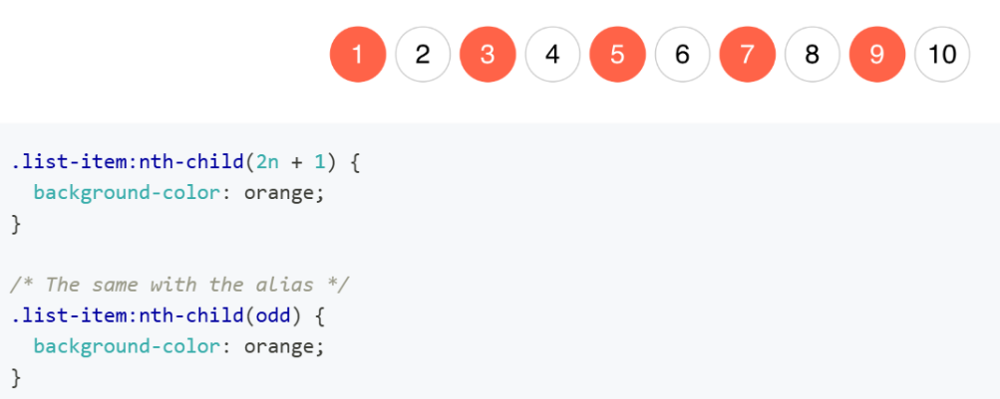
* `:nth-child(n)` — выбор по номеру. Например, `:nth-child(3)` выберет только третий элемент.
   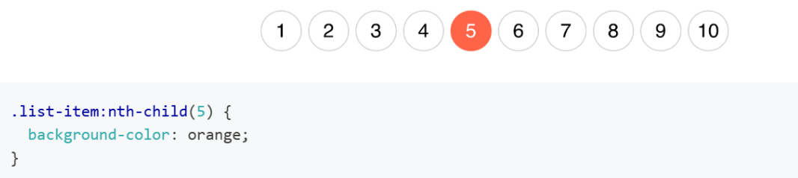
* `:nth-child(n + 6)` — выберет все элементы, начиная с шестого и до конца.
   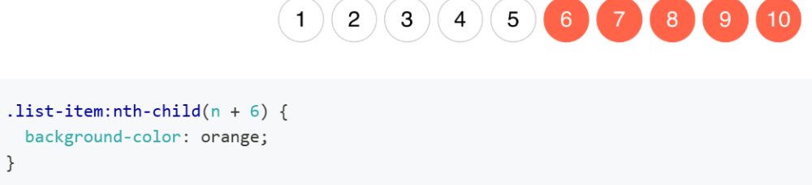
* `:nth-child(-n + 5)` — выберет только первые пять элементов.
  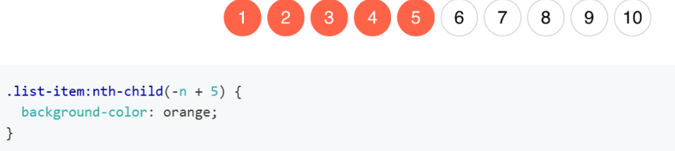
* `:nth-child(3n + 1)` — выберет каждый третий элемент, начиная с первого (1, 4, 7, 10).
  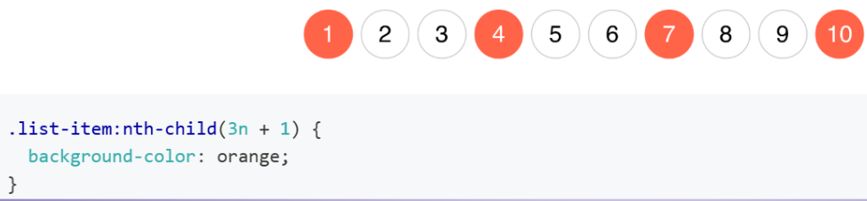

  ### 💡 Шпаргалка по формуле `an + b`:

1. **`a`** — шаг (каждый какой элемент выбираем).
2. **`n`** — переменная (счетчик браузера).
3. **`b`** — смещение (с какого элемента начинаем отчет).
---

### 📚 Полезные ресурсы для закрепления:

* [MDN: Основные понятия Flexbox](https://developer.mozilla.org/ru/docs/Web/CSS/Guides/Flexible_box_layout/Basic_concepts)
* [Игра Flexbox Froggy](https://flexboxfroggy.com/#ru) — **обязательно к прохождению!**
* [Flexbox Zombies](https://mastery.games/flexboxzombies/) — отличная игра для практики.

---
### 📝 Практическое задание:
Используя возможности `display: flex` создай шаблоны страниц по ниже приведённому примеру:
**1** 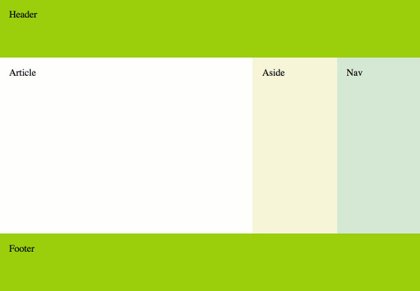
**2** 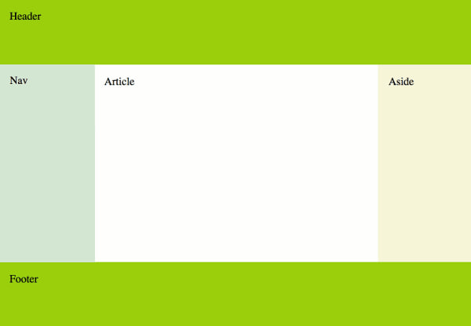
**3**  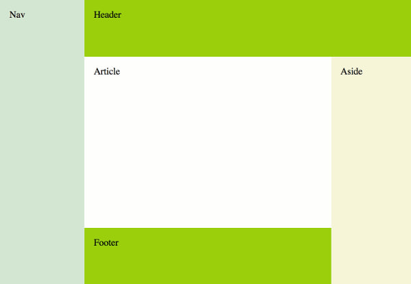
**4**  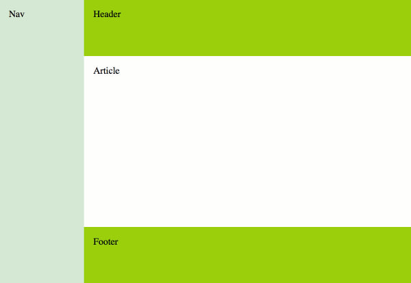
**5**  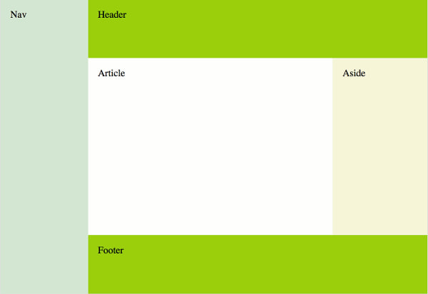
---

### 🗺 Навигация:

[⬅ Лекция 3: Кнопки и Box Model](./lekce3.md) | [🏠 В оглавление](./README.md) | [Лекция 5: Позиционирование ➡](./lekce5.md)
---
