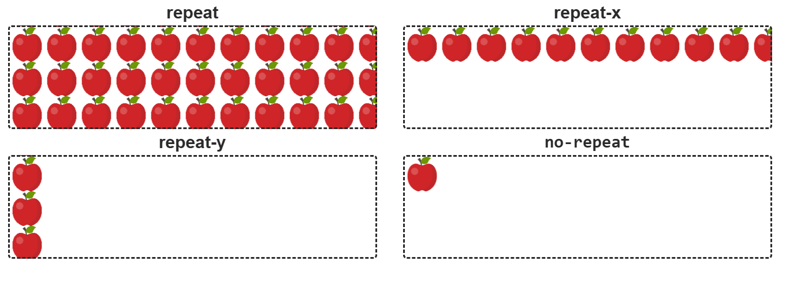
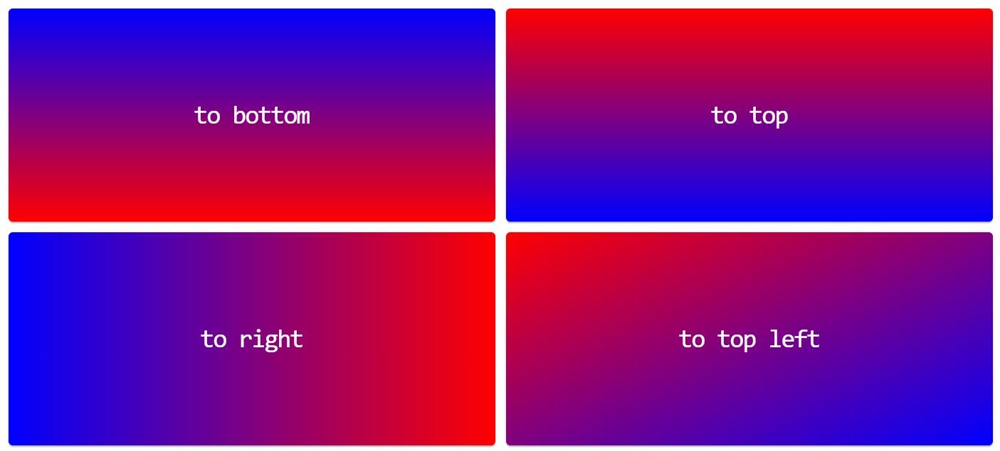

# Лекция 8: Изображения и растровая графика

## 1. Контентные vs Декоративные изображения

Прежде чем выбирать формат, нужно понять роль картинки на странице:

1. **Контентные** — несут смысл. Вставляются через HTML-тег `` с обязательным атрибутом `alt`. Скринридеры читают `alt`, что важно для доступности сайта.
2. **Декоративные** — нужны для оформления. Вставляются через CSS свойство `background-image`. Такие картинки не индексируются поисковиками как важный контент и не печатаются принтером.

---

## 2. Виды графики (Краткий обзор)

### 🧩 Растровая графика (Тема сегодняшней лекции)

Состоит из пикселей (цветных точек). При сильном увеличении картинка становится размытой («пикселится»).

* **Форматы:** `.jpg`, `.png`, `.gif`, `.webp`.
* **Для чего:** Идеально для фотографий и сложных рисунков с плавными переходами цветов.
* **Минус:** Большой вес файла и потеря качества при масштабировании.

### 🧭 Векторная графика (Анонс Лекции 9)

Состоит из математических кривых. Ее можно увеличивать до бесконечности без потери качества.

* **Форматы:** `.svg`.
* **Для чего:** Логотипы, иконки, шрифты. О ней мы подробно поговорим на следующем занятии.

---

## 3. Работа с фоном элемента в CSS

Фон — это важный визуальный слой, который распространяется на области `content` и `padding`, но не затрагивает `margin`.

### Основные свойства:

* `background-color` — цвет фона.
* `background-image: url('...')` — путь к файлу.
* `background-repeat: repeat | repeat-x | repeat-y | no-repeat`
                      **repeat - повторять по X и Y, это значение по умолчанию.**
                      repeat-x - повторять только по X, то есть по горизонтали.
                      repeat-y - повторять только по Y, то есть по вертикали.
                      no-repeat - не повторять.

* `background-position: x y` - управляет положением фонового изображения относительно границ элемента используя две координаты - x по горизонтали и y по вертикали. В качестве значения можно использовать абсолютные единицы или относительные единицы и ключевые слова **(top, bottom, right, left, center)**. По умолчанию заданы значения `left` для `x` и `top` для `y` , то есть фон позиционируется относительно верхнего левого угла элемента.
  **Примеры записи:**
  ```
  /* Поставит фоновое изображение по центру */
  background-position: 50% 50%;
  или
  background-position: center;

  /* Поставит фоновое изображение 100px от левого края и 200px от верха */
  background-position: 100px 200px;

  /* Поставит фоновое изображение в нижний праый угол */
  background-position: right bottom;

  /* Поставит фоновое изображение в верхний левый угол */
  background-position: left top;
  ```
* `background-size: auto | значение | cover | contain` - **`contain`:** - гарантированно сохраняет пропорции изображения, изображению задаются максимально возможнные размеры (не больше оригинала), при которых оно полностью помещается в элемент, изображение может не закрыть весь фон элемента по вертикали или горизонтали, если пропорции блока и изображения не совпадают. **`cover`:** - гарантированно сохраняет пропорции изображения, изображению задаются минимальные размеры, при которых оно зальёт фон всего элемента, если пропорции изображения и элемента разные, часть изображения, по вертикали или горизонтали, визуально обрезается.
* `background-attachment: scroll| fixed | inherit` - **`scroll`** - фон прокручиватеся вместе с содержимым, это значение по умолчанию. **`fixed`** - фон не прокручивается, зафиксирован на месте. **`inherit`** — механизм наследования значения от родителя.
* **Многослойный фон**
Элементу можно задать несколько фоновых изображений одновременно. Достаточно перечислить их в свойстве `background-image` через запятую. Для каждого изображения также можно задать значения других свойств фона, тоже через запятую в каждом свойстве.
```
    background-image: url('картинка-1'), url('картинка-2');
    background-size: 100px, cover;
    background-position: top right, center;
    background-repeat: repeat-x, no-repeat;
```
* **Свойство background**
Составное свойство для одновременного задания значений всех рассмотренных свойств.
```
  background: background-color background-image background-repeat background-position background-attachment
```
Если какой-то компонент не указан, будет взято его значение по умолчанию.
---

## 4. Декоративные эффекты: Градиенты и Тени

### Градиенты (считаются изображениями):

* **Linear-gradient** — переход цветов по прямой. Создается с помощью двух и более цветов, для которых задано направление распостранения (`to bottom`, `to top`, `to left`, `to right` или можно задать угол, например `45deg`). Формат значения цвета может быть любой - ключевые слова, `rgb`, `rgba` или `hex`, и их можно смешивать.
  ```
    linear-gradient(<направление>, <цвет-1>, <цвет-2>, <цвет-3>, ...)
  ```
  
* **Radial-gradient** — переход от центра к краям (круговой).

### Тени (`box-shadow`):

Позволяют добавить глубину. Помни порядок: `x-offset`, `y-offset`, `blur`, `spread`, `color`.

* **Лайфхак:** Используй ключевое слово `inset`, чтобы сделать тень внутри блока:
  ```
    box-shadow: inset 0 0 10px black;
  ```
---
## 5. Псевдоэлементы
Псевдоэлементы `::before` и `::after` используются для добавления декоративных эффектов (иконок, плашек, оверлеев) без необходимости создания дополнительных пустых тегов в разметке.

* `::before` - создаёт псевдоэлемент перед всем контентом элемента (в начале).
* `::after` - создаёт псевдоэлемент после всего контента элемента (в конце).
```
    .box {
      /* стили элемента */
    }
    
    .box::before {
      /* стили псевдоэлемент before */
    }
    
    .box::after {
      /* стили псевдоэлемент after */
    }
```
> **Полезно**
По умолчанию это строчные элементы. Для того, чтобы задать псевдоэлементу вертикальную геометрию, необходимо изменить его тип на блочный или, что чаще всего, строчно-блочный.

Свойство `content`
Это обязательное свойство позволяет добавить текстовый контент внутрь псевдоэлемента. Даже если текстовый контент не нужен, его значением необходимо поставить пустую строку, иначе браузер просто не создаст псевдоэлемент.
```
  <div class="box">
    Lorem, ipsum dolor sit amet consectetur adipisicing elit. Officia itaque quia
    nobis fugit amet adipisci, corrupti animi, iusto eius a sed totam voluptas
    porro. Dolorem aliquid rerum magnam eligendi aspernatur.
  </div>
```
В селекторе можно использовать только один псевдоэлемент, который должен добавляться после простого селектора (тега, класса, идентификатора).
```
    .box::before {
      content: 'Это текст в ::before';
      font-size: 40px;
      color: orange;
    }
    
    .box::after {
      content: 'Это текст в ::after';
      font-size: 30px;
      color: teal;
    }
```
---

### 🗺 Навигация:

[⬅ Лекция 7: Grid Layout](./lekce7.md) | [🏠 В оглавление](./README.md) | [Лекция 9: Векторная графика  SVG ➡](./lekce9.md)
