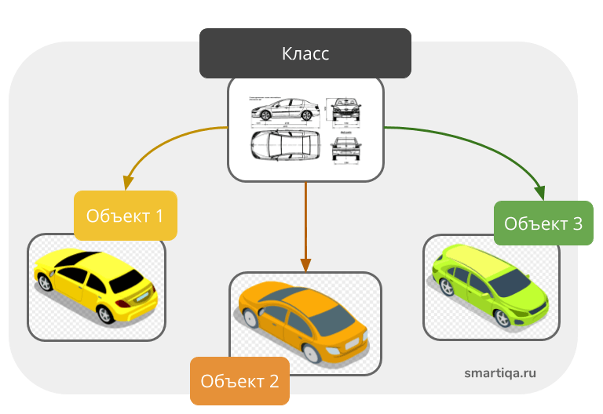

# Лекция 15 — Основы объектно-ориентированного программирования (ООП) и тестирование в JavaScript
## 1️⃣ Объектно-ориентированного программирования
## 1. Функциональный подход vs ООП

До сегодняшнего дня мы с вами в основном работали в **функциональном стиле** программирования. В таком подходе данные (переменные, массивы, объекты) существуют отдельно, а функции — отдельно. Когда нам нужно что-то сделать с данными, мы передаём их в функцию, она их обрабатывает и возвращает результат. Это рабочий и понятный подход.

**Объектно-ориентированное программирование (ООП)** предлагает другой способ мышления.
В ООП:

* Данные и функции объединяются в одну сущность.
* Эта сущность называется **объектом**.
* Объект сам знает, какие данные у него есть, и сам знает, что с ними нужно делать.

> **Главное правило:** В ООП логика и данные живут вместе.

---

## 2. Две основные составляющие ООП


### Класс (шаблон / чертёж)

Это описание того, как должен выглядеть объект, какие данные у него есть и какие действия он может выполнять.
*Важно: Класс не существует в реальности — это просто инструкция.*

### Объект (экземпляр)

Это конкретная реализация класса, то, что создано по чертежу. Это то, с чем мы реально работаем в коде.

**💡 Аналогии из жизни:**

* **Автомобили:** Класс — это чертёж автомобиля. Объект — это конкретная машина, которая сошла с конвейера.
* **Кофемашина:** Сама физическая кофемашина (аппарат) — это объект. Она хранит своё *состояние* (уровень воды, количество зерен) и имеет *методы* (рецепты приготовления эспрессо, капучино). Если у нас сеть из 10 таких машин, мы создадим один **Класс** (шаблон сборки), по которому наштампуем эти 10 объектов.
* **Игровая индустрия:** Армия героев сражается с армией врагов. Передавать сотни переменных (здоровье, урон, броня) в отдельные функции крайне тяжело. Вместо этого мы создаем базовый класс `Солдат`, а от него через наследование — классы `Hero` и `Enemy` с уникальными чертами (супер-удар или ядовитый укус).

> **Зачем нам это на фронтенде?**
> В 90% случаев на фронтенде мы пишем обычные функции. Но если вы захотите написать свою библиотеку, сложный игровой движок на JS или пойти в Backend (Node.js) — без ООП вы не сдвинетесь с места. Мы учим это, чтобы понимать, как устроены инструменты под капотом.

---

## 3. Синтаксис классов (ES6)

В 2015 году (ES6) в JS завезли удобный синтаксис классов, который сделал ООП понятным и структурированным. Создадим простой автопарк.

### Базовый класс и Конструктор

Конструктор — это специальная функция, которая вызывается автоматически в момент создания нового объекта.

```javascript
class Car {
  // Вызывается автоматически, когда мы пишем new Car(...)
  constructor(brand, color, year) {
    // this указывает на тот КОНКРЕТНЫЙ объект, который сейчас создается
    this.brand = brand;
    this.color = color;
    this.year = year;
  }
}

// Создаём объекты (экземпляры класса)
const car1 = new Car("BMW", "black", 2020);
const car2 = new Car("Tesla", "white", 2023);

console.log(car1, car2);

// Мы можем легко изменять свойства объекта
car1.color = "red";
console.log(car1.brand, car1.color); // BMW, red

```

### Строгость конструктора и оператор Rest (`...`)

Конструктор — это строгий фильтр. Если передать больше параметров, чем он ожидает — лишние проигнорируются. Если меньше — недостающие станут `undefined`.
Но мы можем управлять этим с помощью параметров по умолчанию и Rest-оператора:

```javascript
class Car {
  // color по умолчанию "red", а ...otherParams соберет всё остальное в массив
  constructor(brand, year, color = "red", ...otherParams) {
    this.brand = brand;
    this.year = year;
    this.color = color;
    this.extras = otherParams; // Сохраняем дополнительные опции
  }
}

const car1 = new Car("BMW", 2020); 
// Цвет будет "red", extras будет []

const car2 = new Car("Tesla", 2023, "white", "autopilot", "sunroof"); 
// У car2 extras будет ["autopilot", "sunroof"]

```

---

## 4. Методы экземпляра (Instance Methods)

Методы — это функции, которые живут внутри класса. *Слово `function` писать не нужно!* Они работают с данными конкретного объекта через `this`.

```javascript
class Car {
  constructor(brand, year, price) {
    this.brand = brand;
    this.year = year;
    this.price = price;
  }

  // Метод, возвращающий строку с информацией
  getInfo() {
    return `Это ${this.brand}, год выпуска: ${this.year}.`;
  }

  // Метод с вычислениями
  getAge() {
    const result = new Date().getFullYear() - this.year;
    return `Возраст автомобиля ${this.brand}: ${result} лет.`;
  }

  // Добавление новой логики
  getTax() {
    return this.price * 0.1; // Налог 10%
  }
}

```

### 🚀 Почему методы в классах эффективнее обычных функций?

Представьте массив из 1000 объектов автомобилей. Если бы мы захотели добавить им всем функцию `getTax` без использования ООП, нам пришлось бы перебирать массив циклом и **копировать** эту функцию 1000 раз в каждый объект. Это сильно нагружает память!
В ООП мы просто пишем метод `getTax()` **один раз в классе**, и абсолютно любая машина (даже созданная неделю назад) сразу умеет им пользоваться.

---

## 5. Статические методы (`static`)

Статический метод принадлежит **самому классу (чертежу)**, а не конкретному созданному объекту.

**💡 Аналогия:** Есть отдельные машины (BMW, Tesla). А есть автосалон. Задача машины — ездить. Задача автосалона — сравнивать машины, сортировать их по цене, считать статистику.

```javascript
class Car {
  constructor(brand, price, year) {
    this.brand = brand;
    this.price = price;
    this.year = year;
  }

  // 🔹 1. Статический метод сравнения (для сортировки)
  static compare(carA, carB) {
    return carA.price - carB.price;
  }

  // 🔹 2. Статический метод валидации
  static isValidYear(year) {
    return year > 1990;
  }
}

const car1 = new Car("BMW", 30000, 2018);
const car2 = new Car("Audi", 25000, 2015);
const cars = [car1, car2];

// ✅ Правильный вызов (обращаемся к самому классу)
cars.sort(Car.compare); 
console.log(Car.isValidYear(car1.year)); // true

// ❌ Ошибка (у объекта нет статического метода)
// car1.compare(car1, car2); 

```

---

## 6. Наследование (`extends`)

Наследование — это когда один класс перенимает свойства и методы другого, но может добавлять свои уникальные черты или изменять старые.

```javascript
// Базовый класс (Родитель)
class Car {
  constructor(brand, price, year) {
    this.brand = brand;
    this.price = price;
    this.year = year;
  }

  drive() {
    console.log(`${this.brand} едет 🚗`);
  }
}

// Наследуемся от Car (Ребенок)
class ElectricCar extends Car {
  constructor(brand, price, year, battery) {
    super(brand, price, year); // Обязательно вызываем конструктор родителя!
    this.battery = battery;    // Добавляем свое уникальное свойство
  }

  charge() {
    console.log(`${this.brand} заряжается 🔋`);
  }
}

const tesla = new ElectricCar("Tesla", 50000, 2024, 100);

tesla.drive();  // Унаследованный метод от Car
tesla.charge(); // Собственный метод ElectricCar

// Проверка принадлежности к классу
console.log(tesla instanceof ElectricCar); // true
console.log(tesla instanceof Car);         // true (Тесла - это тоже машина)

```

---

## 7. Геттеры и Сеттеры (`get` / `set`)

Это специальные методы, которые снаружи выглядят как обычные свойства, а внутри работают как функции. Они нужны для:

* Контроля доступа к данным.
* Валидации (проверки) значений перед записью.
* Сокрытия внутренней реализации.

*Соглашение: свойства, которые не должны меняться напрямую снаружи, мы называем с нижнего подчеркивания (например, `_price`).*

```javascript
class Car {
  constructor(brand, price, year) {
    this.brand = brand;
    this._price = price; // Скрытое внутреннее поле
    this.year = year;
  }

  // Getter - срабатывает при ЧТЕНИИ свойства
  get price() {
    return this._price;
  }

  // Setter - срабатывает при ЗАПИСИ свойства
  set price(value) {
    if (value <= 0) {
      console.error("❌ Ошибка: Цена должна быть положительной!");
      return;
    }
    this._price = value;
  }
}

const car = new Car("BMW", 30000, 2018);

console.log(car.price); // 30000 (Сработал getter)

car.price = 35000;      // (Сработал setter)
console.log(car.price); // 35000

car.price = -5000;      // ❌ Ошибка: Цена должна быть положительной!

```

---

## 2️⃣ Что такое тестирование и зачем оно нужно?

Тестирование — это процесс проверки того, делает ли программа то, что от неё ожидают, и как она ведёт себя, если что-то идёт не так (например, если пользователь отправляет пустую форму или вводит буквы вместо цифр).

**Зачем это нужно:**

* **Ловить баги до релиза:** Чтобы пользователи не столкнулись со сломанным интерфейсом на продакшене.
* **Защита от поломок (Регрессия):** Когда ты добавляешь новую фичу (например, систему комментариев), тесты автоматически проверяют, не сломала ли она старую логику (например, систему лайков).
* **Спокойствие при рефакторинге:** Можно смело переписывать и улучшать архитектуру кода, зная, что если ты где-то ошибся, авто-тесты мгновенно загорятся красным и укажут на ошибку.

---

### Кто этим занимается на проекте?

1. **Разработчики (Frontend/Backend):** Пишут **Unit-тесты** (модульные тесты). То есть программист пишет код, который проверяет его же собственный код. Обычно тестируются отдельные маленькие функции (математика, форматирование дат, API-запросы).
2. **QA-инженеры (Manual):** Вручную прокликивают интерфейс по специальным сценариям, пытаясь "сломать" сайт так, как это сделал бы неопытный пользователь.
3. **QA Automation-инженеры:** Пишут сложные скрипты, которые имитируют действия пользователя: открывают настоящий браузер, сами кликают по кнопкам, заполняют формы и проверяют, перешел ли сайт на нужную страницу.

---

### Главные инструменты (для фронтенда)

* **Vitest / Jest:** Самые популярные инструменты для Unit-тестирования. *Vitest идеально работает в связке со сборщиком Vite из коробки.*
* **Cypress / Playwright:** Инструменты для E2E-тестирования (End-to-End). Они управляют реальным браузером и проверяют интерфейс целиком (от нажатия кнопки до появления модального окна).

---

### Практический пример (Unit-тест)

Представь, что в нашей социальной сети есть простая функция для безопасного подсчета лайков.

```javascript
// Файл: likes.js
export function addLike(currentLikes) {
  // Дополнительная проверка на случай, если придет не число
  if (typeof currentLikes !== 'number') return 1; 
  return currentLikes + 1;
}

```

Чтобы не проверять её вручную каждый раз в браузере, разработчик пишет рядом файл с авто-тестом. Он выглядит как обычный JS-код, который вызывает функцию и сравнивает результат с ожидаемым.

```javascript
// Файл: likes.test.js
import { test, expect } from 'vitest';
import { addLike } from './likes.js';

test('Функция должна прибавлять ровно 1 лайк к текущему числу', () => {
  // Вызываем функцию с числом 5
  const result = addLike(5);

  // Ожидаем, что результат будет строго равен 6
  expect(result).toBe(6);
});

test('Если передать строку вместо числа, должен вернуться 1 лайк', () => {
  const result = addLike("много");
  expect(result).toBe(1);
});

```

Когда ты запускаешь команду в терминале (например, `npm run test`), умный инструмент за секунду пробегается по всем файлам `.test.js`. Если функция отработает неправильно, терминал выдаст красную ошибку. Если всё окей — загорится зеленая галочка. Это и есть магия автоматизированного тестирования.

### 🛠 Полезные онлайн-инструменты

* [MDN Web Docs: ООП в JavaScript (Официальная документация)](https://developer.mozilla.org/en-US/docs/Learn_web_development/Extensions/Advanced_JavaScript_objects/Object-oriented_programming)
* [Vitest: Главная страница и быстрый старт](https://vitest.dev/guide/) — Инструкция по установке и настройке. Написано очень лаконично, идеально для первого знакомства.
* [MSW (Mock Service Worker)](https://mswjs.io/) — Следующий уровень после `vi.mock()`. Это золотой стандарт для тестирования запросов на сегодня. Вместо того чтобы «глушить» сам Axios, MSW перехватывает запросы прямо на уровне сети. Это делает тесты максимально приближенными к реальности.
* [Testing Library](https://testing-library.com/) — Библиотека, которая используется вместе с Vitest для тестирования самого HTML-интерфейса (нажатия на кнопки, появление текста на экране). Главный принцип библиотеки: *"Тестируй свой интерфейс так, как им пользуется реальный человек"*.

---

### 🗺 Навигация:

[⬅ Лекция 14: Роутинг (Маршрутизация)](./lekce14.md) | [🏠 В оглавление](./README.md)
